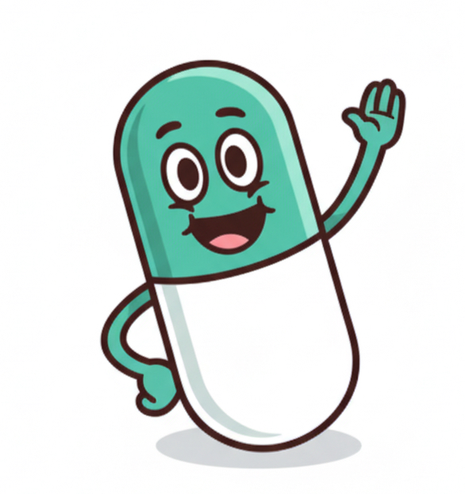

<p align="center">
  
</p>

<h1 align="center" style="font-size: 72px; color: #48C5B6; font-weight: 900; margin-top: 0;">
  PillPal
</h1>

---
## Overview

PillPal is a lightweight frictionless multi-agent medication-assistant prototype. It uses 3 different agents: 
- 🗓️ **Calendar agent**: monitors 24/7 the changes in the user's weekly calendar, providing notifications if an event potentially conflicts with the user's treatment
- 💊 **Interaction agent**: takes as input a new medication, either scanned from a photo or entered manually, and queries a drug interaction database via an API. It determines whether any of the drugs the user is taking negatively interact with the new medication and notifies the user in that case. The notification asks the user whether they would like to email their doctor about this interaction. If the user clicks "yes", the agent automatically generates and sends an email to their doctor.
- 📦 **Purchasing agent**: monitors the quantity of each medication that the user has. Once it reaches a threshold (one week's worth), it notifies the user to refill their prescription, and offers to do it for them. If the user accepts, the purchasing agent will interact with the selected pharmacy website to purchase the medication for the user. 

## Instructions

1. Navigate to [https://www.pillpal.com](http://199.247.26.114/)
   
2. For demonstration purposes, login with username: jan.jansen - password: password. This profile already has medication loaded which will be useful for our demo. You could also create your own username - passsword combination but the profile will be empty by default. 

3. Click the "Add Medication" button.

4. Scan your medication box if you have it or enter the details manually. To showcase the interaction functionality enter a medication that will interact with another (try Ibuprofen).
   
5. Try entering a low amount (try 3 pills) and enter a high frequency (try Daily) so that it will trigger the purchasing agent. 
   
6. In the bottom left, ask the agent a question (try "Can I drink alcohol?"). Observe the agent's response.
   
7. Observe the notification of low medication, click the "Yes" button if you want the agent to buy medication for you. The agent will interact with the pharmacy website in the backend.
   
8. If you entered two medications that interact negatively in Steps 4 and 5, observe the interaction notification. Click the "Email Your Doctor" button to send an email to the doctor's email. Unfortunately the Resend module requires that the receiver be the same email used to sign up for the API key, this can only be circumvented with a verified domain which at this time we didn't setup. 

## Running the Development Server

To start the backend, from the root folder in one terminal:
```
cd Backend
pip install -r requirements
cd ..
python -m Backend.api.server
```
To start the frontend run in another terminal:

```
cd Frontend
npm install
npm run dev
```
Copy the link into your browser. The website should be navigable


